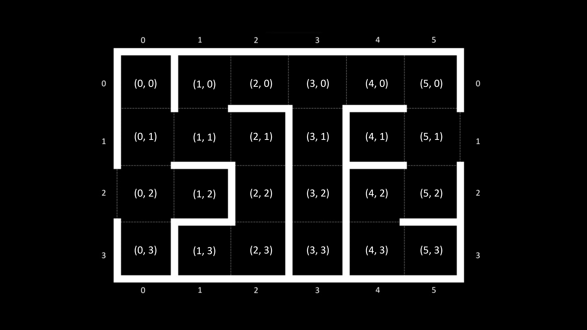
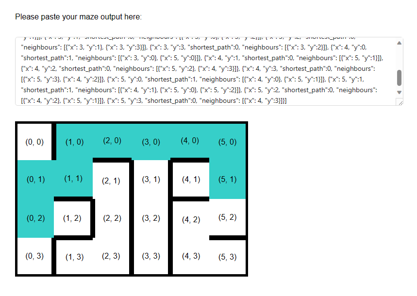

# Robotic Car Maze Mapping & Navigation Demo

The team has decided to demonstrate mapping and navigation without the robotic
car for the final assessment. The "robotic_car_maze" project will be used for 
this demonstration.

There will be 2 modes that the program can run in:

### Predefined Mapping Mode

To use this mode, change line 10 of "robotic_car_maze.c" to:

    #include DEMO_MODE 0

In this mode, mapping and navigation will be preformed on a predefined map
shown below:

### Manual Mapping Mode

To use this mode, change line 10 of "robotic_car_maze.c" to:

    #include DEMO_MODE 1

In this mode, mapping and navigation will be performed by simulating the
movement of the robotic car on a maze and collecting information about the
walls relative to the car's position. Rotation and movement instructions will
be printed on the serial monitor and the operator is required to move the car
on the map accordingly. Questions such as "Is a wall in front of you?" will 
also be asked, and the operator can answer the question by pressing GPIO 20 
for YES and GPIO 21 for NO on the Maker Pi Pico. Using the information collected
the shortest path will then be calculated.

## The Algorithm

### Depth First Search
The car first performs a Depth First Search (DFS) on the map, by recursively 
exploring the neighbours of blocks on the map. After exploring all neighbours, 
the car now has an adjacency list of blocks and their respective neighbours.

### Dijkstra's Algorithm
Using this list, the car is now able to perform the Dijkstra Algorithm to find
the shortest path between the entrance and exit. While the traditional 
Dijkstra's Algorithm uses a priority queue to sort the neighbours with the least
distance, we have implemented it with just a linked list as the distance to all
neighbours is the same in the maze, making the algorithm more efficient as no
sorting is required.

## Displaying the Map
At the end of the map, a JSON string containing the list of all blocks and 
their neighbours will be printed on the serial monitor. The string can be 
copied and pasted into a webpage to display the map as shown below. More 
instructions on how to setup the webpage can be found 
[here](../robotic_car_maze_map_webpage/README.md).

