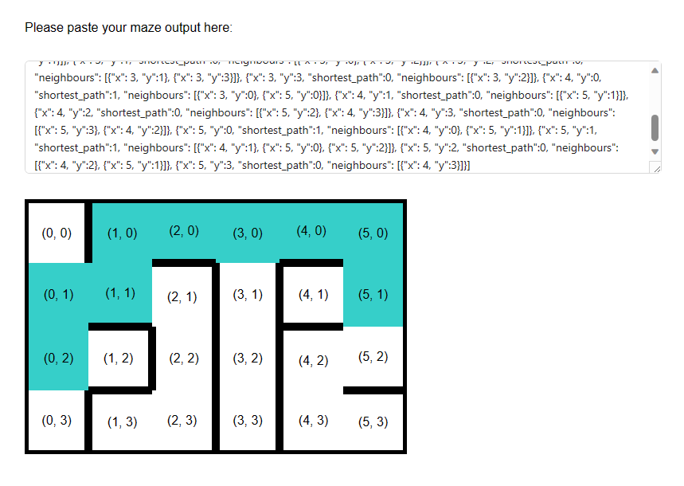

# Robotic Car Maze Map Display

This simple webpage allows you to display the map and shortest path by copying and pasting the JSON output from the 
serial monitor after the performing mapping and navigation. To run the webpage, follow the steps describe below.

## Starting the Web Page

Ensure the [Node](https://nodejs.org/en) is installed.

    node --version
    npm --version

Install dependencies.

    npm install

Start the application.

    npm start

The application should start up automatically at http://localhost:3000/

After pasting the JSON output from the serial monitor, the map and shortest path will be displayed.

 

